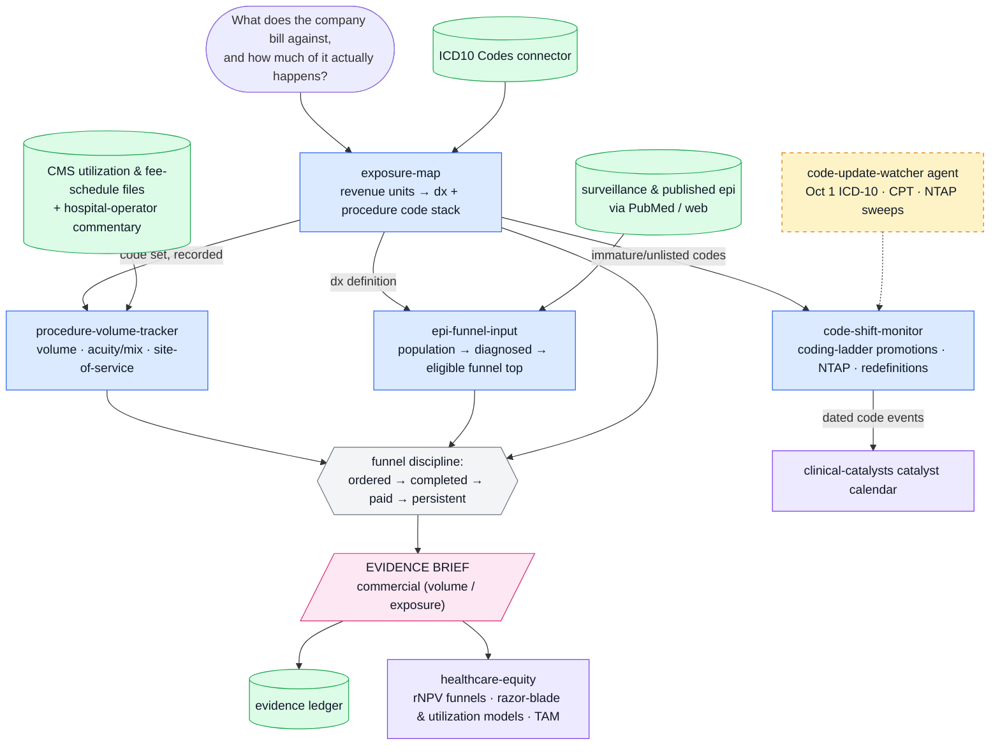

# procedure-exposure — conventions

This plugin is the **what-gets-billed evidence engine** in a five-plugin buy-side healthcare analyst suite (companions: cms-reimbursement, clinical-catalysts, provider-adoption, healthcare-equity). It answers: *which diagnoses and procedures does this company monetize, how much of that actually happens, and is the coding basis shifting.*

## Standing instructions (compact)

You are supporting a buy-side healthcare equity analyst. Source hierarchy: (1) SEC filings and company IR; (2) ClinicalTrials.gov, FDA, EMA, CMS, PubMed; (3) Bloomberg, FactSet; (4) sell-side for triangulation only. Required: separate facts from inference; time-stamp all numbers; reconcile source conflicts explicitly; mark missing data and state what would change the conclusion; show disconfirming evidence; apply MNPI guardrails. End substantive analyses with `Confidence: [0.00–1.00]`.

## Evidence-brief contract (suite-wide)

Every evidence-producing skill ends its output with this block, so briefs compose into the `healthcare-equity` investable view:

```
EVIDENCE BRIEF
Layer:         commercial (volume / exposure)
Finding:       what the primary source says — citation, retrieval date, data vintage
Coverage:      what was searched, roughly how many documents/records, and the known gaps
Moves:         the explicit model variables this moves (probability, timing, units, price, duration/retention, margin, capital)
Not automatic: what this evidence does NOT license you to infer
Follow-up:     the observable that would confirm or refute it
Confidence:    0.00–1.00
```

Anchor "Moves"/"Not automatic" in `${CLAUDE_PLUGIN_ROOT}/references/funnel-discipline.md`: observed usage maps to ONE stage of the funnel (ordered → completed → paid → persistent → cash) — name the stage; it never automatically equals revenue.

## Scope note (be honest about the data)

The hosted connector covers **ICD-10 (diagnosis) codes**. Procedure-side coding lives in CPT/HCPCS (physician/outpatient) and ICD-10-PCS/DRGs (inpatient); their rates live in CMS fee-schedule files. So: use the connector for the diagnosis landscape and code lookups; use CMS public files and web research for procedure codes, volumes, and rates (details in `${CLAUDE_PLUGIN_ROOT}/references/coding-systems-primer.md`); state which code system every claim rests on. Payment/coverage questions belong to the cms-reimbursement plugin; the coverage–coding–payment triad stays separated.

## Data discipline

- Volume data carries its universe label — Medicare FFS files are not all-payer; scale honestly or present Medicare-only with the caveat.
- CMS utilization files are annual with a lag; state the vintage on every volume number.
- Code-keyed epidemiology (prevalence/incidence) and claims volumes are different quantities (disease burden vs treated/billed events) — never substitute one for the other silently.
- When attached to the "Healthcare Plugin" project, `project_search` the KB for clinical-context depth.

## Workflow map

This chart is the plugin's operating topology — routing guidance, not decoration. Enter at the node that matches the question; when a skill completes, check the map for the downstream node and offer it as the natural next step (a brief's Follow-up line is often that node). Edges into the pink output nodes are the evidence-brief handoffs; dashed amber nodes run on schedule, not on request.

When the user asks how this plugin works, what the workflow is, or how the skills fit together, answer with this chart in a fenced `mermaid` code block plus the legend line — it renders on Mermaid-capable surfaces; on plain terminals, walk the main path in a sentence instead.



*Blue = skills · green = data sources & stores · amber (dashed) = agents · pink = evidence outputs · violet = suite handoffs.*

## Evidence discipline (suite v0.2)

**Pinpoint citations.** Every regulatory or clinical factual claim in an output carries an openable citation — URL plus document identifier and section/page. An uncited regulatory or clinical claim is a draft, not evidence. Terminal-sourced market data is attributed to the user's date-stamped terminal pull, never fabricated.

**Precedent discipline checklist** — run before shipping any evidence output:

1. Decision stated — the question is the decision to be made, not a keyword.
2. Document types crossed — reviews/CRLs/labels/EPARs/registries as applicable; patterns live across them.
3. Wide before narrow — assemble the comparable set first, then focus; sampling is where the risk hides.
4. Negatives hunted — failures, refusals, CRLs, discontinuations; negative precedent counts double.
5. Citations opened — every load-bearing citation verified to resolve.

**Evidence ledger.** Every skill that emits an EVIDENCE BRIEF also saves it as a dated markdown file under `~/.claude/data/procedure-exposure/briefs/` (e.g. `briefs/DXCM-coverage-2026-08-25.md`), and monitoring agents keep matched-cohort state under `~/.claude/data/procedure-exposure/snapshots/` — diff against the stored snapshot, never against memory. If writes are refused, add `~/.claude/data` to `sandbox.filesystem.allowWrite` in `~/.claude/settings.json` once. The ledger is what the investable-view capstone, the watchers, and the sell-discipline post-mortems audit.
