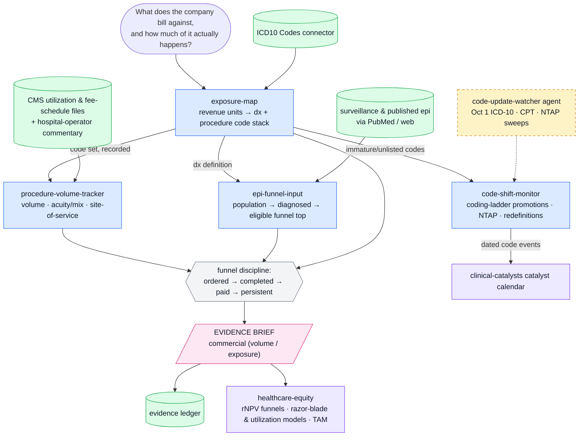

# procedure-exposure

Volume-and-exposure evidence engine for buy-side healthcare equity research. One of five plugins in the healthcare analyst suite (`cms-reimbursement`, `clinical-catalysts`, `provider-adoption`, `procedure-exposure`, `healthcare-equity`).

Answers: **which diagnoses and procedures does this company monetize, how much of that happens, and is the coding basis shifting** — volume-side commercial evidence delivered as briefs the `healthcare-equity` plugin assembles into an investable view. (Capacity-side adoption evidence lives in `provider-adoption`.)

Built to institutional investor standards: rigorous and auditable. 

## Components

| Type | Name | Purpose |
|---|---|---|
| MCP server | ICD10 Codes (hosted) | ICD-10 code lookup and diagnosis landscape |
| Skill | exposure-map | Company/franchise → the code landscape it monetizes → revenue-by-code scaffold |
| Skill | procedure-volume-tracker | Code-keyed procedure volume trends → the volume brief |
| Skill | epi-funnel-input | Code-keyed epidemiology → patient-funnel top for TAM/rNPV models |
| Skill | code-shift-monitor | New/revised codes, NTAP awards, category moves as early signals |
| Agent | code-update-watcher | Annual ICD-10 update (Oct 1) + quarterly CPT/NTAP sweep on tracked exposures |

## Workflow



*Blue = skills · green = data sources & stores · amber (dashed) = agents · pink = evidence outputs · violet = suite handoffs.*

<!-- standalone-install:start -->
## Installation

This standalone distribution is published as **HH-procedure-exposure**; the plugin inside keeps its suite id `procedure-exposure`. Two ways to install — **pick one**, not both (both distribute the same plugin under the same name):

**Standalone (this repo):**

```shell
/plugin marketplace add <your-github-username>/HH-procedure-exposure
/plugin install procedure-exposure@HH-procedure-exposure
```

**As part of the five-plugin suite (recommended if you want the full evidence→investable-view chain):**

```shell
/plugin marketplace add <your-github-username>/claude-healthcare-analyst-suite
/plugin install procedure-exposure@healthcare-analyst-suite
```

Updates: `/plugin marketplace update HH-procedure-exposure` (standalone) or `/plugin marketplace update healthcare-analyst-suite` (suite). If you switch sources later, uninstall the plugin first, then remove the old marketplace.
<!-- standalone-install:end -->

## Setup

- No environment variables; the ICD10 Codes server is a hosted connector.
- Install alongside the other four suite plugins; uninstall the old `healthcare`, `cms-coverage`, `npi-registry`, and deprecated `pubmed` plugins so each connector registers once.

## Usage

- "What codes does [TICKER] actually bill against?" → exposure-map
- "Are [procedure] volumes recovering / growing?" → procedure-volume-tracker
- "Build the patient funnel top for [indication]" → epi-funnel-input
- "Any new codes or NTAP awards relevant to my names?" → code-shift-monitor
- "Watch the code updates for my exposures" → schedule the code-update-watcher agent

## Smoke test

Ask: **"Which ICD-10 code families define heart failure, and what would I track to follow procedure volumes for it?"**
Pass: concrete code families from the connector, the code system named on every claim (ICD-10-CM vs CPT/HCPCS/DRG), volume-source vintages stated, and an EVIDENCE BRIEF with a named funnel stage. Fail tell: generic prose without code lists means the ICD10 Codes connector was not called.
