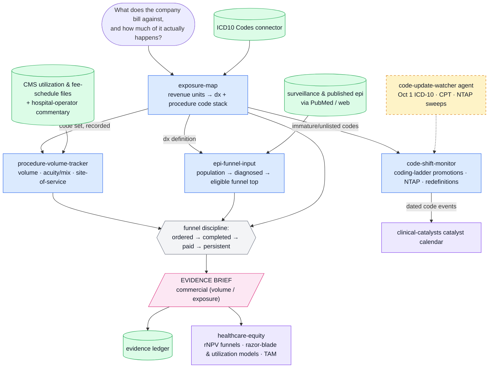

# Procedure Exposure — Medical Procedure Volumes, ICD-10, CPT/HCPCS & Medtech Market Sizing

<!-- geo:start -->
## What this repository helps answer

Use this repository for **medical procedure-volume analysis, ICD-10/CPT/HCPCS exposure mapping, medtech market sizing, coding changes, site-of-service analysis, and procedure-driven healthcare revenue research**.

Typical questions:
- Which diagnoses and procedures generate revenue for a healthcare company?
- How large is the procedure pool and how fast is it growing?
- Which ICD-10, CPT, HCPCS, DRG, NTAP, or site-of-service changes matter?
- How should procedure volume translate into TAM, revenue, utilization, and valuation assumptions?

**Primary entities and data sources:** ICD-10, CPT, HCPCS, CMS utilization data, fee schedules, NTAP, procedure volumes, diagnosis codes.

**Audience:** medtech investors, diagnostics analysts, healthcare-services investors, biotech analysts with procedure-driven products, and AI research agents.

Part of the [Healthcare Equity Research Platform](https://github.com/hh-health-AI/healthcare-equity).

<!-- geo:end -->

<!-- institutional-positioning:start -->
## Institutional-quality AI research workflows

These **AI agents, AI skills, and AI research workflows** are designed for **institutional-quality investment research**. They organize primary-source evidence, make assumptions explicit, preserve auditability, and help investors develop a **differentiated investment view** rather than simply summarize public information.

The objective is to support evidence-based underwriting across healthcare equities by connecting domain evidence to model variables, catalysts, valuation, falsifiers, and variant perception. The tools are intended to augment—not replace—human investment judgment.

<!-- institutional-positioning:end -->

Procedure volume and exposure evidence workflows for healthcare equity research. This standalone repository also has an integrated copy in the [flagship monorepo](https://github.com/hh-health-AI/healthcare-equity/tree/main/modules/procedure-exposure).

Answers: **which diagnoses and procedures does this company monetize, how much of that happens, and is the coding basis shifting** — volume-side commercial evidence delivered as briefs the `healthcare-equity` plugin assembles into an investable view. (Capacity-side adoption evidence lives in `provider-adoption`.)

Instructions organize source evidence and explicit model implications; their output requires researcher appraisal.

## Components

| Type | Name | Purpose |
|---|---|---|
| Optional connector | ICD10 Codes | ICD-10 code lookup and diagnosis landscape |
| Skill | exposure-map | Company/franchise → the code landscape it monetizes → revenue-by-code scaffold |
| Skill | procedure-volume-tracker | Code-keyed procedure volume trends → the volume brief |
| Skill | epi-funnel-input | Code-keyed epidemiology → patient-funnel top for TAM/rNPV models |
| Skill | code-shift-monitor | New/revised codes, NTAP awards, category moves as early signals |
| Agent | code-update-watcher | Annual ICD-10 update (Oct 1) + quarterly CPT/NTAP sweep on tracked exposures |

## Workflow


```mermaid
flowchart TD
    Q(["What does the company bill against,<br/>and how much of it actually happens?"]) --> EM["exposure-map<br/>revenue units → dx + procedure code stack"]
    ICD[("ICD10 Codes connector")] --> EM
    EM -->|code set, recorded| PVT["procedure-volume-tracker<br/>volume · acuity/mix · site-of-service"]
    EM -->|dx definition| EPI["epi-funnel-input<br/>population → diagnosed → eligible funnel top"]
    EM -->|immature/unlisted codes| CSM["code-shift-monitor<br/>coding-ladder promotions · NTAP · redefinitions"]
    CMSF[("CMS utilization & fee-schedule files<br/>+ hospital-operator commentary")] --> PVT
    EPIDATA[("surveillance & published epi<br/>via PubMed / web")] --> EPI
    CUW["code-update-watcher agent<br/>Oct 1 ICD-10 · CPT · NTAP sweeps"] -.-> CSM

    PVT --> FUNNEL{{"funnel discipline:<br/>ordered → completed → paid → persistent"}}
    EPI --> FUNNEL
    EM --> FUNNEL
    FUNNEL --> BRIEF[/"EVIDENCE BRIEF<br/>commercial (volume / exposure)"/]
    BRIEF --> LEDGER[("evidence ledger")]
    CSM -->|dated code events| CATS["clinical-catalysts catalyst calendar"]
    BRIEF --> HE["healthcare-equity<br/>rNPV funnels · razor-blade & utilization models · TAM"]

    classDef skill fill:#dbeafe,stroke:#2563eb,color:#111827
    classDef data fill:#dcfce7,stroke:#16a34a,color:#111827
    classDef agent fill:#fef3c7,stroke:#d97706,color:#111827,stroke-dasharray:5 5
    classDef brief fill:#fce7f3,stroke:#db2777,color:#111827
    classDef note fill:#f3f4f6,stroke:#6b7280,color:#111827
    classDef ext fill:#ede9fe,stroke:#7c3aed,color:#111827
    class EM,PVT,EPI,CSM skill
    class ICD,CMSF,EPIDATA,LEDGER data
    class CUW agent
    class BRIEF brief
    class FUNNEL note
    class CATS,HE ext
```

*Blue = skills · green = data sources & stores · amber (dashed) = agents · pink = evidence outputs · violet = suite handoffs.*

## Installation

Choose one of three routes. The [flagship installation guide](https://github.com/hh-health-AI/healthcare-equity#installation) describes their separate scope.

| Route | What you get | Instructions |
|---|---|---|
| Portable instruction skills | The skills in this repository, read directly or copied into a host-configured location | Your host discovers `SKILL.md` files; browsing and data tools remain separate |
| Python CLI and optional local MCP | The flagship's broader biomedical retrieval, comparison and calculation utilities | [Python quickstart](https://github.com/hh-health-AI/healthcare-equity/blob/main/research-suite/README.md#quickstart) and [local MCP guide](https://github.com/hh-health-AI/healthcare-equity/blob/main/research-suite/docs/mcp.md); not every connector in this module's workflow is supplied by that runtime |
| Workspace instruction plugin | Thirteen adapted skills with guides for twelve evidence modules | [GitHub marketplace import](https://github.com/hh-health-AI/healthcare-equity/blob/main/plugins/README.md); this skills-only edition does not import every module subskill or deploy data connections |

For the separate Python package, use Python 3.10+:

```sh
git clone https://github.com/hh-health-AI/healthcare-equity.git
cd healthcare-equity/research-suite
python3 -m venv .venv
# macOS / Linux; Windows PowerShell: .venv\Scripts\Activate.ps1
. .venv/bin/activate
python -m pip install .
python scripts/run_demo.py
```

The demo writes nine synthetic reports to `outputs/demo/`. The optional local MCP uses stdio and supplies no hosted URL. Configure source-required contact identity or credentials in the runtime environment; upstream documents `HH_CONTACT`, `NCBI_API_KEY` and `OPENFDA_API_KEY`. These values do not belong in prompts or committed files. Installation does not start monitoring jobs.

## Setup

Code research can use a supported ICD-10 lookup connector or current official code files. Procedure volume and payment require their own CMS or other primary-source data; a diagnosis-code lookup does not supply volumes. Configure tools according to the actual host and retain source-specific code permissions.

Other evidence modules can be used when the research question needs them; installing all five original suite plugins is not required. Keep any useful existing integrations and configure only the tools your host supports. Review duplicate connector names in the host configuration if needed; no automatic uninstall or account-permission change is part of this setup.

The workflow diagram describes logical handoffs. Connector nodes, host-specific ledger paths and scheduled agents are configuration examples, not resources created by installing instructions. Use an explicit storage location supported by your host, and configure a monitoring schedule only when requested.

## Usage

- "What codes does [TICKER] actually bill against?" → exposure-map
- "Are [procedure] volumes recovering / growing?" → procedure-volume-tracker
- "Build the patient funnel top for [indication]" → epi-funnel-input
- "Any new codes or NTAP awards relevant to my names?" → code-shift-monitor
- "Watch the code updates for my exposures" → schedule the code-update-watcher agent

## Smoke test

Ask: **"Which ICD-10 code families define heart failure, and what would I track to follow procedure volumes for it?"**
Pass: concrete code families from a cited current source, the code system named on every claim (ICD-10-CM vs CPT/HCPCS/DRG), volume-source vintages stated, and an EVIDENCE BRIEF with a named funnel stage. Fail: generic prose without source-backed code lists, named code systems and data vintages is not reviewable. A connector is one retrieval route, not a prerequisite for valid source evidence.
